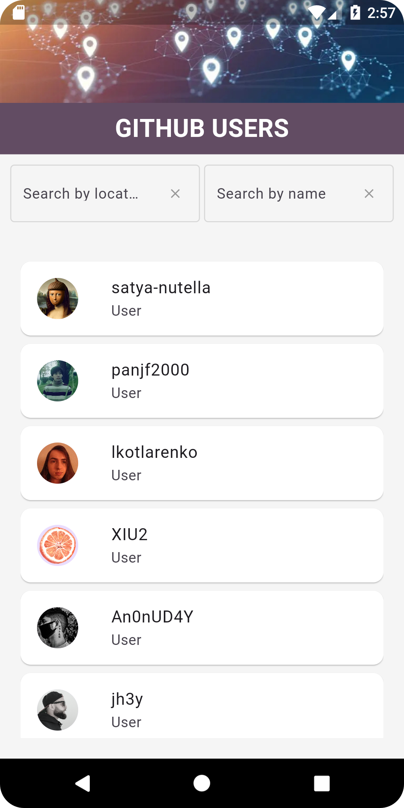
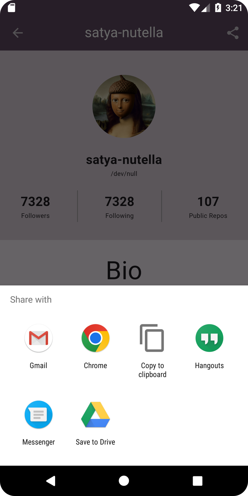
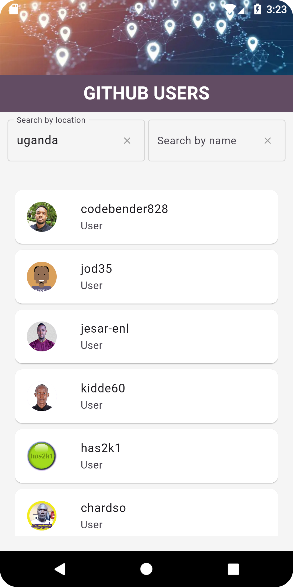
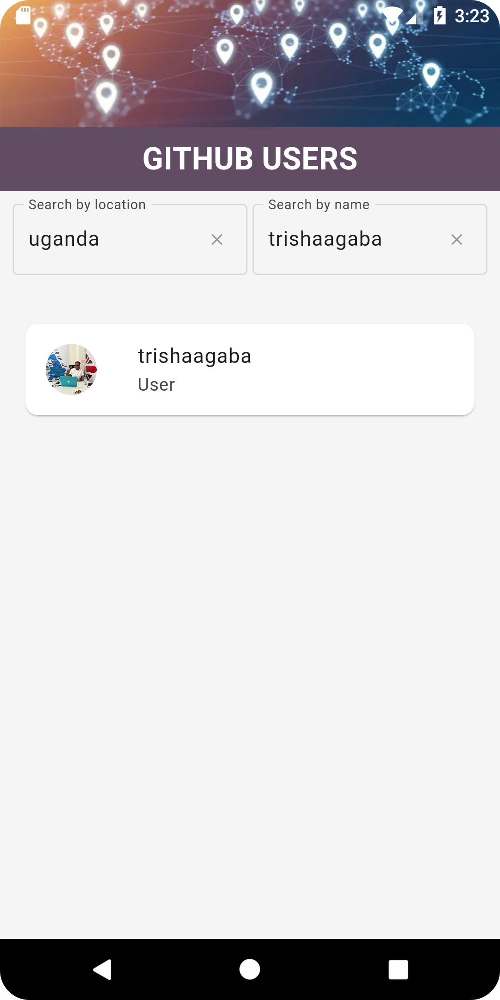

## GIT-USER-APP

## Introduction

This is an app called Github Users that lets you search about Github users from all over the world
and view the different profiles of these users.
The main goal of this app is to let users get in touch with each other and have easier access to
each other's profiles. It aims to solve the inability of users to reach out to each other via
Github.

## Features

The key features of my application are the following;
-List of users all over the world
-Pagination on the list of users
-Search buttons to search either by location or name

## Getting Started

Instructions on how to set up and run the project locally.

### Prerequisites

To run this application, ensure to have the following tools installed and running.

- Flutter SDK
- Android Studio or VsCode
- Flutter plugin
- Dart plugin
- Any other dependencies such as;
    * http: ^1.2.1
    * provider: ^6.1.2
    * share: ^2.0.4
    * json_annotation: ^4.9.0
    * url_launcher: ^6.3.0
    * infinite_scroll_pagination: ^4.0.0
    * connectivity_plus : ^2.3.0
    * shared_preferences : ^2.0.9
    * device_info_plus: ^9.0.0
    * android_intent_plus: ^3.0.1

### Installation

Step-by-step instructions on how to install the project.

1. Clone the repository:
   ```sh
   git clone https://github.com/your-username/your-repo.git
   ```
2. Navigate to the project directory:
   ```sh
   cd your-repo
   ```
3. Install dependencies:
   ```sh
   flutter pub get
   ```

### Running the App

Instructions on how to run the app on an emulator or a physical device.

1. Run the app:
   ```sh
   flutter run
   ```

## Usage

When the app is launched on the screen of the device, you are navigated to the Home Page after the
Splash screen has been displayed.
From there, a list of Github users is displayed from which you can scroll. To search for a specific
country, you can search using the 'Search Location' button,
while to search for a specific user, you can search using the 'Search Name' button. From thereon,
you can select a user's name to navigate to their profile page which displays
various information such as the country or number of public repositories. You can even choose to be
redirected to the user's profile or can even share the user's details.

## Screenshots

Below are some screenshots of the application.


## Home Page


## User Profile


## Share Profile


## Search Location


## Search User


## Contributing

Guidelines for contributing to the project.

## Contributing

Guidelines for contributing to the project.

1. Fork the repository
2. Create your feature branch (`git checkout -b feature/AmazingFeature`)
3. Commit your changes (`git commit -m 'Add some AmazingFeature'`)
4. Push to the branch (`git push origin feature/AmazingFeature`)
5. Open a pull request

## Contact

To reach out, contact me on:

- Email: agabatrisha@gmail.com
- GitHub: https://github.com/trishaagaba
- Twitter: https://twitter.com/trisha_agaba


